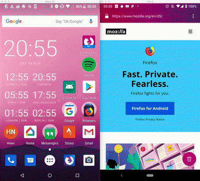

# Session Sharing
A simple POC for sharing sessions with other devices on the same Wi-Fi network.

**(WORK IN PROGRESS)** If local network sharing isn't possible, it falls back to uploading a session to [Firefox Send][0] and converting the url into a QR to be scanned by another client.



# Install

Import the project into Android Studio and hit run.

**via Gradle:**

```
./gradlew installDebug
```


[0]: https://send.firefox.com	"Firefox Send"